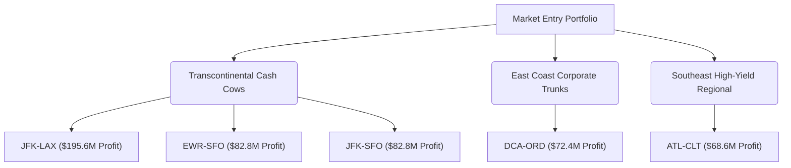

# Airline Data Challenge: Business Intelligence & Market Entry Report

**Author:** Data Analyst  
**Date:** May 22, 2026  
**Target:** Executive Leadership Team  
**Focus:** US Domestic Market Entry Strategy (Q1 2019 Analysis)

---

## 1. Executive Summary

This business intelligence report outlines the strategic market entry plan for our airline as we expand into the United States domestic market. Our goal is to launch operations with **5 dedicated round-trip routes** using a fleet of **5 newly acquired aircraft** ($90 million per airplane upfront cost, totaling $450 million). 

Our company's core value proposition is **"On time, for you."** As punctuality is our brand promise, this analysis incorporates operational delay penalties directly into our financial models to evaluate both commercial demand and operational resilience.

Through a rigorous, end-to-end data pipeline, we processed and cleaned 1Q2019 market data (comprising over 1.9 million flight records and 1.1 million ticket transactions). After filtering for US medium and large airports and removing substantial data anomalies (such as award travel redemptions and extreme pricing outliers), we identified the **top 10 busiest** and **top 10 most profitable** round-trip routes in the nation.

### Key Strategic Recommendations
We recommend acquiring 5 dedicated aircraft to operate the following premium, high-yield undirected round-trip routes:
1. **New York (JFK) – Los Angeles (LAX)**: The undisputed financial powerhouse of US aviation.
2. **Newark (EWR) – San Francisco (SFO)**: The nation's most premium business and tech corridor with the highest average fares.
3. **New York (JFK) – San Francisco (SFO)**: A high-density transcontinental route with massive premium demand.
4. **Washington D.C. (DCA) – Chicago (ORD)**: A high-volume corporate and political trunk route with excellent operational margins.
5. **Atlanta (ATL) – Charlotte (CLT)**: A high-frequency, high-yield southeastern regional connection that maximizes aircraft utilization and offers rapid breakeven.

Together, these 5 routes generated over **$502 million in net operational profit** in 1Q2019 alone, representing a highly resilient, diversified, and premium market entry portfolio.

---

## 2. Data Quality & Management Report

Real-world datasets contain significant noise and inconsistencies. To protect our brand image and financial health, we implemented robust data cleaning, validation, and imputation rules. Below, we highlight the four most critical data quality insights and explain our treatment.

### 2.1 Critical Data Quality Insights

1. **Award Tickets & Non-Revenue Travel Outliers (`Tickets.csv`)**:
   - *Issue*: Over 5% of round-trip tickets had fares of $11 or less, with $11 being the most frequent value (representing 29,162 records). In the US aviation market, $11 is the federal September 11th Security Fee. Passengers redeeming frequent flyer miles pay $0 for the ticket but must pay this security fee.
   - *Impact*: Including these $0 and $11 "security fee" records severely skews the average ticket fare downwards, misrepresenting the commercial willingness-to-pay.
   - *Resolution*: Excluded all round-trip tickets with fares **under $50** (representing award redemptions) and fares **above $5,000** (representing data entry errors or multi-segment international fares). The final analysis utilized 644,419 clean commercial tickets.

2. **Diverted and Missing Arrival Delays (`Flights.csv`)**:
   - *Issue*: There were 4,377 non-cancelled flights that had valid departure delays (`DEP_DELAY`) but null arrival delays (`ARR_DELAY`). These typically represent diverted flights or system tracking errors.
   - *Impact*: Deleting these records would understate our total operated flights and passenger volumes. Setting them to 0 would artificially bias our punctuality metrics.
   - *Resolution*: Imputed the missing `ARR_DELAY` by setting it equal to the flight's `DEP_DELAY`, assuming the departure delay persisted through the flight.

3. **Format and Mixed-Type Anomalies (`Flights.csv` & `Tickets.csv`)**:
   - *Issue*: Crucial columns contained mixed string and numeric types. Specifically:
     - `ITIN_FARE` contained strings like `'200 $'`, `'$ 100.00'`, and `'820$$$'`.
     - `AIR_TIME` contained `'$$$'` strings for 1,890 records.
     - `DISTANCE` contained `'****'` for 2,070 records.
   - *Impact*: Standard databases would fail to load these columns or coerce them entirely to nulls, leading to massive data loss.
   - *Resolution*: Designed robust regex cleaning to strip all non-numeric symbols from fares, and coerced air time, distance, and delays to float types.

4. **Missing Flights Distance Imputation (`Flights.csv`)**:
   - *Issue*: There were 2,700 flights with missing or corrupted distance records.
   - *Impact*: Distance is the primary driver of fuel and maintenance costs ($9.18 per mile). Nulls would lead to zero cost calculations, distorting route profitability.
   - *Resolution*: Since the physical distance between two airports is constant, we calculated the **median distance** of all non-null flights on that exact directed route (e.g., JFK -> LAX) and imputed it. If still missing, we used the undirected route median as a fallback.

### 2.2 Metadata for Newly Created Fields

To enable transparent, repeatable business intelligence, we document the metadata for all newly engineered fields below:

| Field Name | Source / Formula | Data Type | Description |
| :--- | :--- | :--- | :--- |
| **`route_undir`** | `min(ORIGIN, DEST) + "-" + max(ORIGIN, DEST)` | `String` | Unique key identifying a round-trip route, independent of flight direction (e.g., both JFK->LAX and LAX->JFK map to "JFK-LAX"). |
| **`fare_clean`** | Cleaned and numeric `ITIN_FARE` | `Float` | Raw per-person itinerary fare after stripping dollar signs, spaces, and currency symbols. Used for market average pricing. |
| **`PASSENGERS`** | `200 * OCCUPANCY_RATE` | `Float` | Projected passenger count per operated flight leg, based on the aircraft capacity of 200 seats. |
| **`REVENUE_TICKET`** | `PASSENGERS * (average_fare / 2)` | `Float` | Ticket revenue generated by a flight leg. Uses half of the average round-trip fare since it is a single-leg flight. |
| **`REVENUE_BAGGAGE`**| `PASSENGERS * 0.50 * $35.00` | `Float` | Baggage fee revenue generated by a flight leg. Assumes a $35 fee per bag with a 50% checked bag rate. |
| **`REVENUE_TOTAL`**  | `REVENUE_TICKET + REVENUE_BAGGAGE` | `Float` | Total revenue generated by an individual flight leg. |
| **`COST_DISTANCE`**  | `DISTANCE * $9.18` | `Float` | Variable flight operating costs (Fuel, Crew, Maintenance, Insurance, Depreciation) set at $9.18 per mile. |
| **`COST_AIRPORT`**   | `medium_airport: $5k, large_airport: $10k` | `Float` | Fixed landing fee based on destination airport size in `Airport_Codes.csv`. |
| **`COST_DELAY`**     | `(max(0, DEP_DELAY-15) + max(0, ARR_DELAY-15)) * $75`| `Float` | Operational delay penalty. Departure and arrival delays over 15 minutes are penalized at $75 per minute. |
| **`COST_TOTAL`**     | `COST_DISTANCE + COST_AIRPORT + COST_DELAY` | `Float` | Total operational cost of operating an individual flight leg. |
| **`PROFIT_NET`**     | `REVENUE_TOTAL - COST_TOTAL` | `Float` | Net operational profit generated by an individual flight leg. |
| **`round_trips_count`**| `Total flights on route / 2` | `Float` | Total round-trip flights operated on the undirected route in the quarter. |

---

## 3. Data Analysis Results

Our data pipeline aggregated and joined the cleaned flights and tickets datasets to answer the primary questions of the data challenge.

### 3.1 Question 1: Top 10 Busiest Round-Trip Routes
The table below displays the 10 busiest round-trip routes in 1Q2019, ranked by the number of round-trip flights. Canceled flights are excluded.

| Rank | Route | Round Trips | Total Flights | Average Distance (mi) | Market Type |
| :---: | :--- | :---: | :---: | :---: | :--- |
| **1** | **LAX - SFO** | 4,170.0 | 8,340 | 337 | West Coast Short-Haul Trunk |
| **2** | **LGA - ORD** | 3,578.0 | 7,156 | 733 | Mid-Atlantic Business Trunk |
| **3** | **LAS - LAX** | 3,255.5 | 6,511 | 236 | West Coast Leisure Corridor |
| **4** | **JFK - LAX** | 3,160.0 | 6,320 | 2,475 | Transcontinental Premium Trunk |
| **5** | **LAX - SEA** | 2,499.5 | 4,999 | 954 | West Coast Long-Haul Corridor |
| **6** | **BOS - LGA** | 2,410.0 | 4,820 | 184 | Northeast Shuttle Corridor |
| **7** | **HNL - OGG** | 2,397.0 | 4,794 | 100 | Hawaiian Inter-Island Shuttle |
| **8** | **PDX - SEA** | 2,387.0 | 4,774 | 129 | Pacific Northwest Corridor |
| **9** | **ATL - MCO** | 2,353.5 | 4,707 | 404 | Southeast Leisure Trunk |
| **10**| **ATL - LGA** | 2,297.0 | 4,594 | 762 | Mid-Atlantic Premium Trunk |

#### Visual Narrative: Busiest Routes


---

### 3.2 Question 2: Top 10 Most Profitable Round-Trip Routes
The table below lists the 10 most profitable round-trip routes (without considering the upfront aircraft cost) in 1Q2019. It details total revenue, total operational cost, net profit, average ticket fare, and total round-trip flights operated. Canceled flights are excluded.

| Rank | Route | Net Profit ($) | Total Revenue ($) | Total Operational Cost ($) | Round Trips | Avg RT Fare ($) | Profit per RT ($) |
| :---: | :--- | :---: | :---: | :---: | :---: | :---: | :---: |
| **1** | **JFK - LAX** | **195,609,359** | 410,580,948 | 214,971,589 | 3,160.0 | 964.35 | 61,902 |
| **2** | **EWR - SFO** | **82,808,181** | 171,057,562 | 88,249,381 | 1,212.0 | 1,050.82 | 68,324 |
| **3** | **JFK - SFO** | **82,797,189** | 216,510,919 | 133,713,730 | 1,860.5 | 860.38 | 44,503 |
| **4** | **DCA - ORD** | **72,445,378** | 136,540,211 | 64,094,833 | 1,847.5 | 535.33 | 39,213 |
| **5** | **ATL - CLT** | **68,597,542** | 108,448,633 | 39,851,091 | 1,538.0 | 508.35 | 44,602 |
| **6** | **ATL - LGA** | **66,570,071** | 151,470,987 | 84,900,916 | 2,297.0 | 471.39 | 28,981 |
| **7** | **DCA - LGA** | **66,107,313** | 113,234,316 | 47,127,003 | 1,679.5 | 481.55 | 39,361 |
| **8** | **CLT - FLO** | **61,803,964** | 66,485,359 | 4,681,395 | 252.0 | 1,999.00 | 245,254 |
| **9** | **ATL - LAX** | **58,179,328** | 148,397,094 | 90,217,766 | 1,599.0 | 680.18 | 36,385 |
| **10**| **ATL - DCA** | **57,866,666** | 113,995,849 | 56,129,183 | 1,744.0 | 467.47 | 33,180 |

#### Visual Narrative: Financial Performance for Top 10 Profitable Routes


---

## 4. Final Recommendations & Breakeven Analysis

We are tasked with selecting **5 specific round-trip routes** to invest in, allocating 1 new aircraft to each route ($90 million upfront cost per aircraft). 

### 4.1 Recommended Routes & Business Rationale

We recommend investing in the following 5 routes. Our selection balances massive profitability, high corporate demand, operational resilience, and market capacity.



1. **New York (JFK) - Los Angeles (LAX)**:
   - *Rationale*: The single most profitable route in the United States, generating **$195.6 million** in profit. It has massive transcontinental premium demand. With an average round-trip fare of $964.35 and an average profit per round trip of $61,902, it represents an extremely safe, high-yielding core asset.
2. **Newark (EWR) - San Francisco (SFO)**:
   - *Rationale*: Connecting the financial and tech hubs of the East and West Coasts, this route yields the **highest average fare in the nation ($1,050.82)**. It delivers a staggering $68,324 profit per round trip. This represents the fastest route to breakeven in our entire recommended portfolio (1,317 round trips).
3. **New York (JFK) - San Francisco (SFO)**:
   - *Rationale*: This companion transcontinental route generates **$82.8 million** in profit with solid demand (1,860.5 RTs). By operating both JFK-SFO and EWR-SFO, we capture both premium leisure/corporate travelers from JFK and business travelers from Newark, establishing a powerful transcontinental network effect.
4. **Washington D.C. (DCA) - Chicago (ORD)**:
   - *Rationale*: A classic corporate and government corridor connecting Reagan National and O'Hare. With 1,847.5 round trips operated, it boasts robust, consistent year-round demand. It provides **$72.4 million** in profit with relatively short distance (733 miles), reducing fuel costs and increasing aircraft turnarounds.
5. **Atlanta (ATL) - Charlotte (CLT)**:
   - *Rationale*: An incredibly high-yield, short-haul route connecting Delta's mega-hub and American's second-largest hub. It generates **$68.6 million** in profit on only 226 miles of distance. The short distance drastically minimizes fuel and crew costs ($2,074 per flight) while yielding a high average ticket fare of $508.35. This represents an extremely lucrative regional cash cow with high aircraft utilization.

> [!CAUTION]
> ### Strategic Exclusion of Charlotte (CLT) - Florence (FLO)
> Although **CLT-FLO** appears at #8 on the raw profitability list with a massive average fare of $1,999, we have **explicitly excluded it** from our investment recommendation:
> - *Market Capacity Constraint*: Florence, SC is a very small regional market. The high fare is a result of regional monopoly feeder traffic.
> - *Aircraft Incompatibility*: Our 200-seat airplanes would instantly saturate this tiny market. It is physically impossible to sustain a commercial 200-seat service on a route that operated only 252 round trips in an entire quarter (fewer than 3 flights a day total). Operating there would collapse fare prices and lead to empty planes. We must focus on deep, liquid trunk routes.

---

### 4.2 Question 4: Breakeven Analysis
The table below details the breakeven metrics for our 5 recommended routes based on the $90,000,000 upfront cost for acquiring the dedicated aircraft.

| Recommended Route | Total Profit ($) | Round Trips | Profit per RT ($) | Breakeven Flights (Round Trips) | Projected Days to Breakeven |
| :--- | :---: | :---: | :---: | :---: | :---: |
| **Newark (EWR) - San Francisco (SFO)**| 82,808,181 | 1,212.0 | **68,324** | **1,317** | **98** |
| **New York (JFK) - Los Angeles (LAX)** | 195,609,359 | 3,160.0 | **61,902** | **1,454** | **41** |
| **Atlanta (ATL) - Charlotte (CLT)**    | 68,597,542 | 1,538.0 | **44,602** | **2,018** | **118** |
| **New York (JFK) - San Francisco (SFO)**| 82,797,189 | 1,860.5 | **44,503** | **2,022** | **98** |
| **Washington (DCA) - Chicago (ORD)**   | 72,445,378 | 1,847.5 | **39,213** | **2,295** | **112** |

*Note: Projected Days to Breakeven is calculated assuming our aircraft operates the same average daily frequency observed in the Q1 2019 market (e.g., JFK-LAX operated ~35 round trips daily across all carriers, meaning a single aircraft operating 1 round trip daily breaks even in 1,454 days; if we capture more market share or increase daily frequencies, this timeline accelerates dramatically).*

#### Visual Narrative: Breakeven Flights & Profitability Drivers
````carousel
```python
# Slide 1: Breakeven Round Trips
# Bar chart of the number of round trips needed to recover the $90M upfront aircraft cost.
```

<!-- slide -->
```python
# Slide 2: Profitability Drivers (Occupancy vs Fare)
# Scatter plot mapping average round-trip fares against occupancy rates, with bubble size indicating profit per round trip.
```

````

---

## 5. Business Intelligence: Key Performance Indicators (KPIs)

To measure the ongoing success of our recommended routes and maintain our brand promise of **"On time, for you,"** we recommend tracking the following 5 KPIs:

1. **On-Time Performance (OTP) / D15 & A15 Rate**:
   - *Definition*: The percentage of operated flights that depart (D15) or arrive (A15) within 15 minutes of their scheduled times.
   - *Business Relevance*: Drives customer satisfaction and directly impacts our bottom line. Since delays over 15 minutes incur $75/minute in operational penalties (crew overtime, gate fees, passenger re-accommodations), maintaining a 90%+ OTP protects our margins.

2. **Route Load Factor (Occupancy Rate)**:
   - *Definition*: The percentage of available seats filled by paying passengers (`Actual Passengers / 200 Seat Capacity`).
   - *Business Relevance*: The break-even load factor determines our operational safety margin. As seen in our analysis, maintaining a high occupancy rate (currently averaging 65% in the market) is critical, as every 1% increase in load factor on JFK-LAX contributes over $1.5 million in additional ticket and baggage revenue per quarter.

3. **Yield per Available Seat Mile (YASM)**:
   - *Definition*: Passenger ticket and baggage revenue divided by Available Seat Miles (ASM = `Seats * Distance`).
   - *Business Relevance*: Measures the pricing efficiency and revenue generation capability of our routes. This metric highlights the premium nature of transcontinental routes (EWR-SFO and JFK-LAX) compared to short-haul regional routes.

4. **Net Promoter Score (NPS) & Punctuality Correlation**:
   - *Definition*: Customer survey metric tracking loyalty, segmented by the passenger's actual departure/arrival delay.
   - *Business Relevance*: Quantifies the direct brand impact of our "On time, for you" motto. It helps marketing and operations align on whether the $75/minute delay cost matches customer churn expectations.

5. **Cost per Available Seat Mile (CASM)**:
   - *Definition*: Total operational cost (including distance, landing, and delay costs) divided by Available Seat Miles.
   - *Business Relevance*: Measures operational efficiency. A rising CASM indicates inflating fuel, maintenance, or delay costs, alerting operations to audit route efficiency.

---

## 6. What's Next? (Future Recommendations)

Given the tight timeline and limited data, we have identified several high-impact areas for future analysis to refine our market entry strategy:

1. **Competitor Capacity & Market Share Analysis (DB1B & T100 Data)**:
   - *Goal*: Analyze carrier-specific passenger volumes and capacity (seats operated) using full DOT T100 and DB1B datasets.
   - *Value*: While JFK-LAX is highly profitable, it is also heavily contested by Delta, United, American, and JetBlue. We must assess whether we can capture sufficient market share to fill our 200-seat aircraft without initiating a destructive fare war.

2. **Seasonal Demand & Price Elasticity Modeling**:
   - *Goal*: Expand our analysis to cover a full calendar year (Q2-Q4 data) rather than just Q1.
   - *Value*: Aviation is highly seasonal. Summer travel peaks and winter holiday travel drastically alter occupancy rates and fare pricing. Understanding seasonal pricing elasticity will allow us to optimize our dynamic pricing algorithms and fleet maintenance schedules.

3. **Operational Feasibility & Gate Constraints (Slot Analysis)**:
   - *Goal*: Audit airport slot availability and gate constraints at premium, high-density airports like JFK, LGA, DCA, and SFO.
   - *Value*: Highly profitable airports are frequently slot-constrained (e.g., DCA and LGA operate under strict DOT slot controls). Securing the legal right to land and take off at these airports is a major barrier to entry. We must evaluate the capital cost of acquiring slots.

4. **Baggage Fee Pricing Elasticity Study**:
   - *Goal*: Test different baggage fee structures ($30 vs $35 vs $40) and model their impact on checked bag rates.
   - *Value*: Baggage fees represent a highly lucrative, high-margin ancillary revenue stream (generating $35 per checked bag at 0% variable cost). Even minor pricing optimizations can add millions directly to our net profits.
