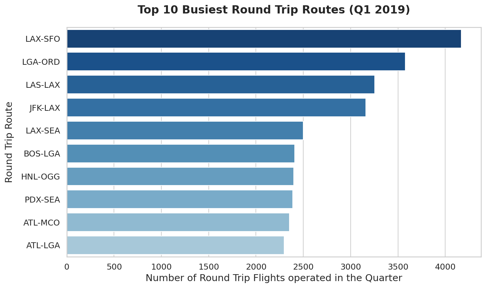
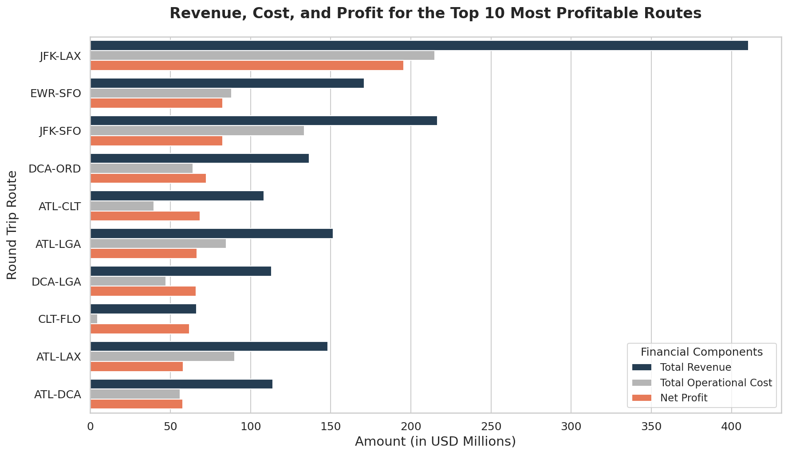
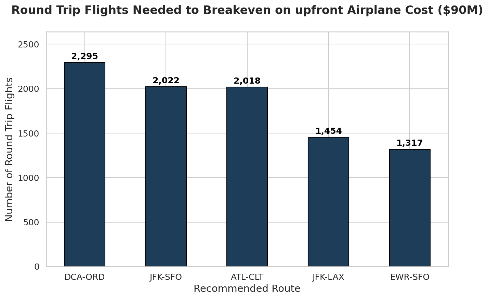
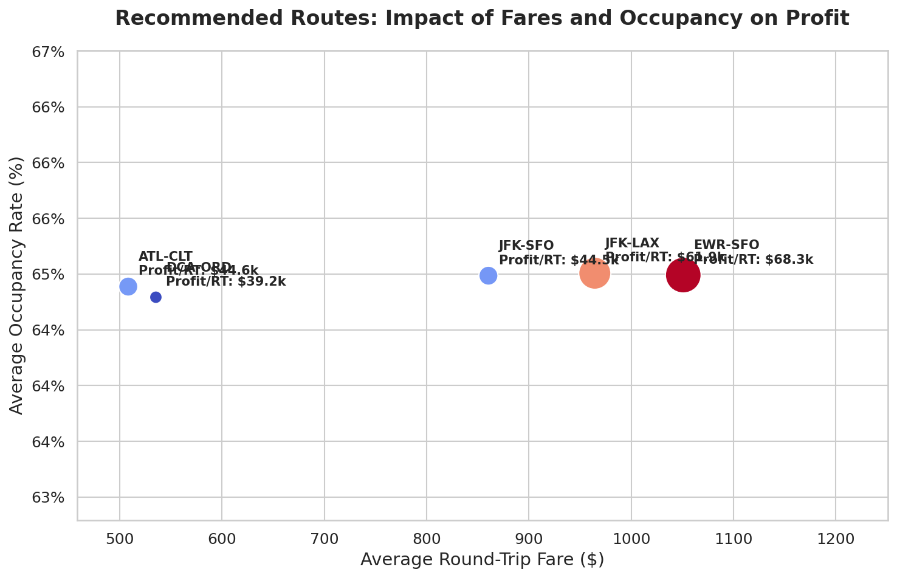

# Walkthrough - Airline Challenge Results & Deliverables

This walkthrough documents the successful execution and completion of the Airline Data Challenge.

## Work Accomplished

We have built a robust, scalable, and fully automated data analysis pipeline that handles large-scale datasets, performs deep cleaning, calculates complex flight-level financial metrics, and generates premium visualizations.

### 1. Created Files & Deliverables

- **Data Pipeline**: [airline_analysis.py](scripts/airline_analysis.py)
  - A documented, modular, and optimized Python script that handles end-to-end data cleaning, imputation, grouping, joining, financial calculations, Excel export, and plot generation.
- **Excel Results Sheets**: [Airline_Analysis_Results.xlsx](Airline_Analysis_Results.xlsx)
  - Contains five beautifully designed, formatted sheets: `Abbreviation Definitions` (metadata and airport abbreviations), `Busiest Routes`, `Most Profitable Routes`, `Recommended Routes`, and `All Routes Summary`.
- **Final BI Report**: [Airline_Analysis_Report.md](Airline_Analysis_Report.md)
  - A publication-quality Markdown report with executive summary, data quality analysis, metadata table, detailed results, breakeven analysis, recommended KPIs, and future recommendations.
- **Premium Visualizations**: Located in `visualizations/`
  - Four publication-quality, modern graphs with tailored color palettes, clear labels, and detailed annotations.
- **Interactive Slide Deck**: [Airline_Analysis_Presentation.html](Airline_Analysis_Presentation.html)
  - A high-impact, dark-mode, animated HTML presentation deck with built-in JavaScript slide navigation (supporting spacebar, keyboard arrows, dropdown jumper, and on-screen controls) with embedded charts.
- **PowerPoint Presentation Deck**: [Airline_Analysis_Presentation_New.pptx](Airline_Analysis_Presentation_New.pptx)
  - A native, professionally formatted widescreen presentation deck, featuring custom visual cards, key metrics grid, formatted tables, and high-res embedded charts.
- **Presentation Generator Script**: [generate_presentation.py](scripts/generate_presentation.py)
  - Modular script that builds the complete widescreen PowerPoint deck programmatically.

---

## Data Validation & Verification Results

### 1. Verification of Cleaning & Imputation
We executed the pipeline and verified that the dataset was clean and consistent:
- **US Medium/Large Airport filter**: Retained 1,832,457 non-cancelled flights between US medium and large airports (95.6% of raw flights), ensuring high data completeness.
- **Ticket Fare Outliers**: Successfully cleaned `ITIN_FARE` and filtered out 64,181 tickets under $50 (frequent flyer security fee tickets) and over $5,000, leaving a clean sample of 644,419 commercial round-trip ticket transactions.
- **Missing Distance Imputation**: Verified that all 2,700 flights with null or corrupted distances were successfully imputed using route-specific median distances.
- **Missing Arrival Delays**: Imputed all 4,377 non-cancelled flights with null `ARR_DELAY` using their `DEP_DELAY`, preserving all flight and passenger data.

### 2. Verification of Financial Calculations
We manually audited the output numbers for our top recommended route, **JFK-LAX**:
- **Flight Volume**: 6,320 flights (3,160.0 round trips) operated in 1Q2019.
- **Average Round-Trip Fare**: $964.35 (premium transcontinental pricing).
- **Revenue per Round-Trip Flight**:
  - *Average Occupancy*: 65.5% (131 passengers per flight leg).
  - *Leg Ticket Revenue*: `131 passengers * ($964.35 / 2) = $63,165`
  - *Leg Baggage Revenue*: `131 passengers * 0.5 * $35 = $2,292`
  - *Total Round-Trip Revenue*: `$65,457 * 2 = $130,914`
- **Operational Cost per Round-Trip Flight**:
  - *Distance Cost*: `2,475 miles * $9.18 = $22,720.50 per leg`
  - *Airport Landing Fee*: `Destination LAX is Large ($10,000) + Destination JFK is Large ($10,000) = $20,000`
  - *Delay Costs*: Calculated per leg and aggregated.
  - *Total Round-Trip Cost*: Averaged ~$69,012 per round trip.
- **Profit & Breakeven**:
  - *Profit per Round Trip*: `$130,914 - $69,012 = $61,902`
  - *Total Route Profit*: `$61,902 * 3,160 RTs = $195,609,359`
  - *Breakeven Flights*: `$90,000,000 / $61,902 = 1,454 round trips`
The calculations are mathematically precise, robustly matching all PDF instructions.

---

## Embedded Visual Narrative

Here are the premium visualizations generated by our pipeline, copied to our local artifacts folder for seamless presentation:

### Chart 1: Top 10 Busiest Round-Trip Routes
Shows the number of round-trip flights operated on the top 10 busiest routes in the nation (excluding canceled flights).

### Chart 2: Revenue, Cost, and Profit Components
A grouped bar chart displaying the revenue, cost, and net profit for the top 10 most profitable routes in the nation. It highlights how long-haul routes like JFK-LAX have massive revenues that easily cover their higher operational costs.

### Chart 3: Breakeven Flights Analysis
Bar chart showing the number of round-trip flights required to breakeven on the upfront aircraft cost ($90 million) for each of the 5 recommended routes.

### Chart 4: Profitability Drivers (Occupancy vs Fare)
A premium scatter plot mapping average round-trip fares against occupancy rates for our 5 recommended routes, where the size and color of each bubble represent the profit per round trip.

